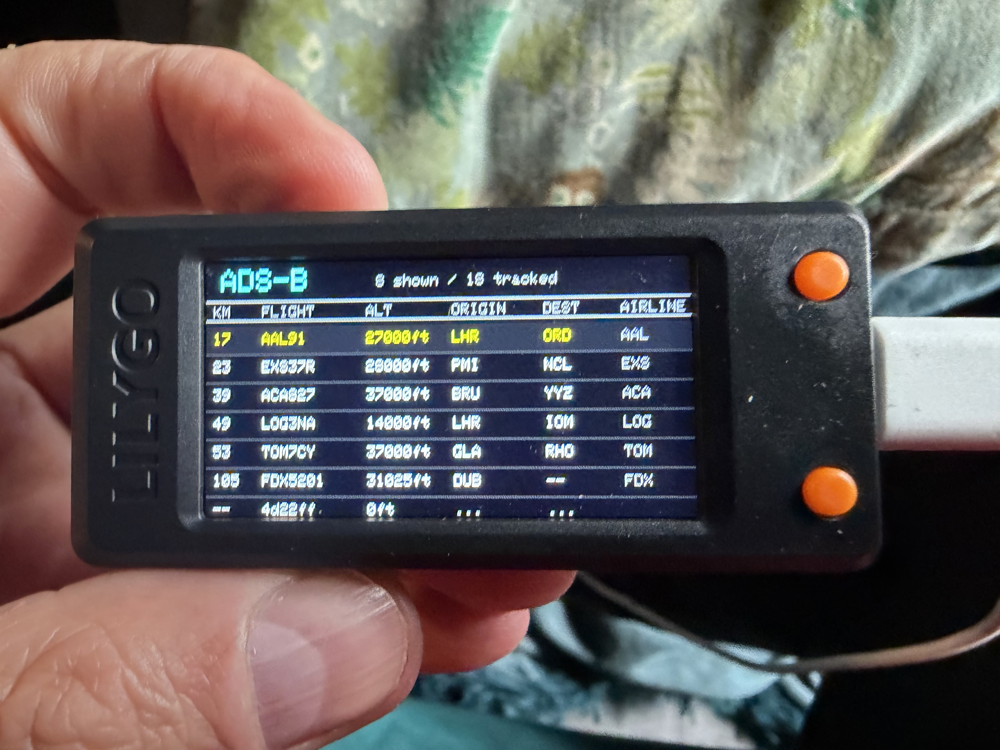

# PiAware Display

A live ADS-B aircraft display for the **LilyGO T-Display S3** (ESP32-S3). Reads aircraft data from a local PiAware / dump1090 receiver and looks up flight routes via the FlightAware AeroAPI.



---

## What It Shows

**List view** — up to 7 nearest aircraft sorted by distance, showing:
- Distance (km)
- Flight number
- Altitude
- Origin and destination (IATA codes)
- Airline name

**Detail view** — full information on the selected aircraft:
- Flight number (large)
- Origin → Destination (large IATA codes)
- Airline name
- Altitude, distance, last seen
- GPS position

Route data is fetched from the FlightAware AeroAPI and cached on-device, so each flight is only looked up once.

---

## Controls

| Action | Result |
|--------|--------|
| Button 14 | Scroll forward / next aircraft |
| Button 0 | Scroll back / previous aircraft |
| Both together | Toggle between list and detail view |

---

## Hardware

- **LilyGO T-Display S3** — [LilyGO GitHub](https://github.com/Xinyuan-LilyGO/T-Display-S3)
- **PiAware receiver** — a Raspberry Pi running [PiAware](https://www.flightaware.com/adsb/piaware/) with a DVB-T USB stick and antenna, on the same local network
- USB-C cable for programming the T-Display S3

---

## Software Setup

### 1. Arduino IDE

Install [Arduino IDE 2.x](https://www.arduino.cc/en/software).

### 2. ESP32 Board Package

In Arduino IDE go to **File → Preferences** and add this to Additional Board Manager URLs:

```
https://raw.githubusercontent.com/espressif/arduino-esp32/gh-pages/package_esp32_index.json
```

Then go to **Tools → Board → Boards Manager**, search for `esp32` and install version **2.0.14**.

> ⚠️ Version 2.0.14 specifically — newer versions have compatibility issues with the T-Display S3.

### 3. TFT_eSPI Library

Download the LilyGO version of TFT_eSPI (not the Library Manager version):

1. Go to [https://github.com/Xinyuan-LilyGO/T-Display-S3](https://github.com/Xinyuan-LilyGO/T-Display-S3)
2. Download the repo as a ZIP
3. Copy the `TFT_eSPI` folder into your Arduino libraries folder (`~/Documents/Arduino/libraries/`)
4. Delete any existing TFT_eSPI folder first

### 4. ArduinoJson Library

In Arduino IDE go to **Tools → Manage Libraries**, search for `ArduinoJson` and install version **7.x** by Benoit Blanchon.

### 5. Board Settings

| Setting | Value |
|---------|-------|
| Board | ESP32S3 Dev Module |
| Upload Speed | 921600 |
| USB Mode | Hardware CDC and OTG |
| USB CDC On Boot | Enabled |
| Flash Mode | QIO 80MHz |
| Flash Size | 16MB (128Mb) |
| Partition Scheme | 16M Flash (3MB APP/9.9MB FATFS) |
| PSRAM | OPI PSRAM |

---

## Configuration

Open `config.h` and fill in your values.

### WiFi

```cpp
#define WIFI_SSID      "your-network-name"
#define WIFI_PASSWORD  "your-password"
```

The T-Display S3 only supports 2.4GHz networks.

---

### PiAware URL

Find the correct URL by opening these addresses in your browser until one returns JSON:

```
http://YOUR_IP:8080/data/aircraft.json       ← most common
http://YOUR_IP/dump1090-fa/data/aircraft.json
http://YOUR_IP/skyaware/data/aircraft.json
http://YOUR_IP/tar1090/data/aircraft.json
```

Replace `YOUR_IP` with the local IP address of your PiAware box (e.g. `192.168.1.50`). You can find this in your router's device list or by running `hostname -I` on the Pi.

```cpp
#define PIAWARE_URL  "http://192.168.1.50:8080/data/aircraft.json"
```

---

### Home Coordinates

Set your home latitude and longitude — used to calculate distance from each aircraft to your location. Find yours at [latlong.net](https://www.latlong.net).

```cpp
#define HOME_LAT  52.9717f
#define HOME_LON  -1.1599f
```

---

### FlightAware AeroAPI Key

The AeroAPI is used to look up origin and destination airports from a flight's callsign.

**As a PiAware feeder you receive $10 of free AeroAPI credit per month** — more than enough for a home display. However you need to sign up for AeroAPI separately from your feeder account:

1. Go to [flightaware.com/aeroapi/portal](https://www.flightaware.com/aeroapi/portal)
2. Sign in with your FlightAware account
3. Create an API key
4. Paste it into `config.h`

```cpp
#define AEROAPI_KEY  "your-key-here"
```

**How credit is used:**  
Route lookups are cached on-device — each unique callsign is only looked up once per session. At one new lookup per 5-second refresh cycle, and with most aircraft staying in range for several minutes, typical usage is well within the free $10/month credit.

---

## Uploading

1. Plug in the T-Display S3 via USB-C
2. Hold the **BOOT** button on the device while clicking Upload in Arduino IDE
3. Release BOOT once the upload starts
4. The device will restart and show "PiAware Display / Connecting..."

If the port doesn't appear, you may need the [CP210x driver](https://www.silabs.com/developers/usb-to-uart-bridge-vcp-drivers).

---

## Troubleshooting

**"WiFi failed!" on startup**  
Check SSID and password in `config.h`. Ensure your network is 2.4GHz.

**List shows no aircraft**  
Check the PiAware URL in `config.h` — open it in a browser on the same network to confirm it returns JSON. Check the Serial Monitor (115200 baud) for HTTP status codes.

**Routes showing "..." indefinitely**  
The AeroAPI lookup may be failing. Check your API key and that you have credit remaining at [flightaware.com/aeroapi/portal](https://www.flightaware.com/aeroapi/portal). Check the Serial Monitor for AeroAPI HTTP status codes.

**Routes showing "---"**  
The flight was looked up but no route data was found. This is normal for military aircraft, private flights, and some cargo operators that aren't in the AeroAPI database.

**Distances look wrong**  
Check your `HOME_LAT` and `HOME_LON` coordinates in `config.h`.

---

## Serial Monitor

Connect at **115200 baud** to see debug output including HTTP status codes for both the PiAware feed and AeroAPI lookups, and cache hit/miss logging.

---

## How It Works

1. On boot, the sketch fetches the aircraft list from your local PiAware receiver
2. Aircraft are sorted by distance from your home coordinates
3. For each visible aircraft with a callsign, a route lookup is queued to the FlightAware AeroAPI
4. Route results are cached by callsign — subsequent refreshes reuse cached data
5. Every 5 seconds the aircraft list is refreshed; one new uncached route lookup is made per cycle

---

## Credits

- [FlightAware](https://www.flightaware.com) — PiAware and AeroAPI
- [LilyGO](https://github.com/Xinyuan-LilyGO/T-Display-S3) — T-Display S3 hardware and TFT_eSPI library

---

## Licence

MIT — do what you like with it.
